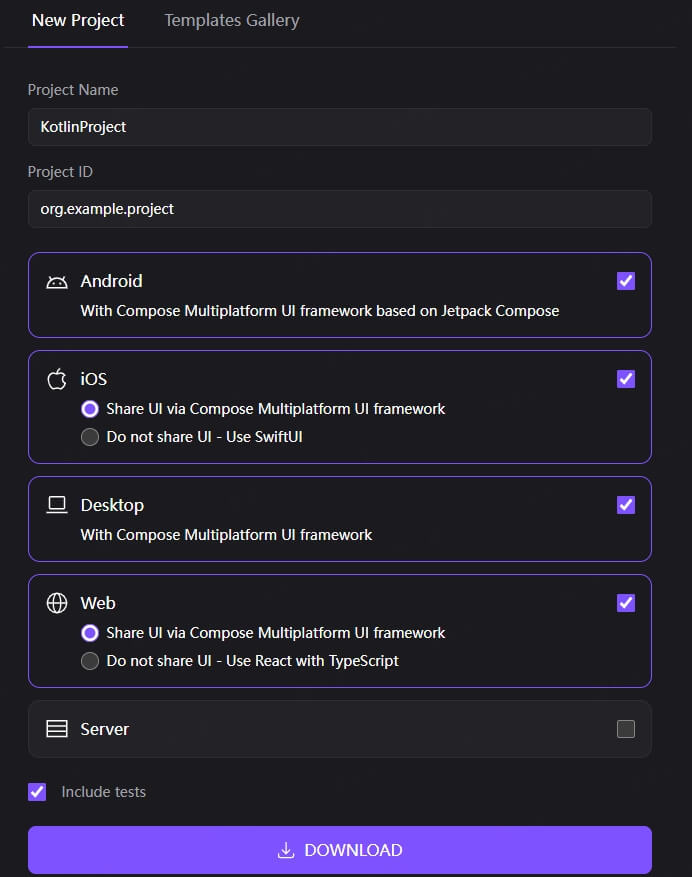

### Kotlin Multiplatform Compose

#### 一、新建项目
以 Android Studio 为例，创建 Kotlin Multiplatform 项目并集成 Compose Multiplatform：

1. **环境准备**  
   - Android Studio 版本 ≥ Narwhal 2025.1.1，安装插件 Kotlin Multiplatform IDE plugin 
   - 配置 JDK 17（Kotlin Multiplatform 推荐版本）
   - 如果要编译 mac 版本，需要安装 xcode，通过 xcode 编译 app

2. **创建项目**  
Windows 和 Linux 平台上，Android Studio 不支持直接创建项目， 可以通过 [KMP web wizard](https://kmp.jetbrains.com/?android=true&ios=true&iosui=compose&desktop=true&web=true&webui=compose&includeTests=true) 生成项目
   - 打开网页，选中新项目  
   - 填写项目信息：  
     - **Project Name**：项目名称（如 `MyMultiplatformApp`）  
     - **Project ID**：应用包名  
     - 选择支持的平台  
   - 点击 **下载**，通过 Android Studio 导入下载的代码
    

3. **添加 Compose Multiplatform 依赖**  
   打开项目根目录的 `settings.gradle.kts`，确保包含 Compose 插件仓库：
   ```kotlin
   pluginManagement {
       repositories {
           google()
           mavenCentral()
           gradlePluginPortal()
           maven("https://maven.pkg.jetbrains.space/public/p/compose/dev") // Compose Multiplatform 仓库
       }
   }
   ```

   在共享模块（如 `shared`）的 `build.gradle.kts` 中添加 Compose 依赖：
   ```kotlin
   kotlin {
       android()
       jvm("desktop")
       iosX64()
       iosArm64()
       iosSimulatorArm64()

       sourceSets {
           val commonMain by getting {
               dependencies {
                   implementation(compose.runtime)
                   implementation(compose.foundation)
                   implementation(compose.material3)
                   implementation(compose.ui)
                   @OptIn(org.jetbrains.compose.ExperimentalComposeLibrary::class)
                   implementation(compose.components.resources)
               }
           }
           // 其他平台 sourceSets 配置...
       }
   }
   ```


#### 二、项目结构
Kotlin Multiplatform 项目采用多模块结构，核心分为**共享模块**和**平台专属模块**，典型结构如下：

```
MyMultiplatformApp/
├── app/                     // Android 应用模块
│   ├── src/main/
│   │   ├── AndroidManifest.xml  // Android 配置
│   │   ├── java/               // Android 专属代码（可选）
│   │   └── kotlin/
│   │       └── com/example/myapp/
│   │           └── MainActivity.kt  // Android 入口
├── jvm/                 // 桌面应用模块（JVM）
│   ├── src/main/kotlin/
│   │   └── Main.kt          // 桌面入口（启动 Compose）
├── iosApp/                  // iOS 应用模块
│   ├── iosApp/              // Xcode 项目目录
│   └── src/iosMain/         // iOS 专属代码
├── shared/                  // 共享模块（核心逻辑）
│   ├── src/
│   │   ├── commonMain/      // 跨平台共享代码
│   │   │   ├── kotlin/      // 共享业务逻辑、数据模型
│   │   │   │   ├── data/    // 数据层（如实体类、仓库）
│   │   │   │   ├── domain/  // 领域层（如用例）
│   │   │   │   └── ui/      // 共享 UI 组件（Compose）
│   │   │   └── resources/   // 共享资源（图片、字符串等）
│   │   ├── androidMain/     // Android 平台专属代码
│   │   ├── desktopMain/     // 桌面平台专属代码
│   │   ├── iosMain/         // iOS 平台专属代码
│   │   └── commonTest/      // 共享测试代码
│   └── build.gradle.kts     // 共享模块配置
├── build.gradle.kts         // 项目全局配置
└── settings.gradle.kts      // 项目模块管理
```


#### 三、核心模块说明
1. **shared 模块**  
   - **commonMain**：所有平台共享的代码，包括：  
     - 数据模型（如 `data class User`）  
     - 业务逻辑（如网络请求、数据处理）  
     - 共享 Compose UI 组件（如 `Button`、`Screen`）  
   - 平台专属目录（如 `androidMain`、`iosMain`）：用于实现平台特定逻辑（如 Android 的 `Context` 调用、iOS 的原生 API 交互）

2. **平台模块**  
   - **app**（Android）：Android 应用入口，通过 `setContent` 加载共享 Compose UI  
   - **jvm**（JVM）：桌面应用入口，通过 `application { ... }` 启动 Compose  
   - **iosApp**（iOS）：通过 Xcode 构建，调用共享模块的 Kotlin 代码（生成 Framework 集成）


#### 四、示例：共享 Compose UI 组件
在 `shared/src/commonMain/kotlin/ui` 中创建共享组件：
```kotlin
// Greeting.kt
import androidx.compose.material3.Text
import androidx.compose.runtime.Composable
import androidx.compose.ui.tooling.preview.Preview

@Composable
fun Greeting(name: String) {
    Text("Hello, $name!")
}

@Preview
@Composable
fun GreetingPreview() {
    Greeting("World")
}
```

在 Android 模块中使用：
```kotlin
// MainActivity.kt
class MainActivity : ComponentActivity() {
    override fun onCreate(savedInstanceState: Bundle?) {
        super.onCreate(savedInstanceState)
        setContent {
            Greeting("Android")
        }
    }
}
```

在桌面模块中使用：
```kotlin
// Main.kt
fun main() = application {
    Window(onCloseRequest = ::exitApplication) {
        Greeting("Desktop")
    }
}
```


通过以上结构，可实现一套代码在 Android、iOS、桌面平台的复用，仅需针对平台特性编写少量专属代码。